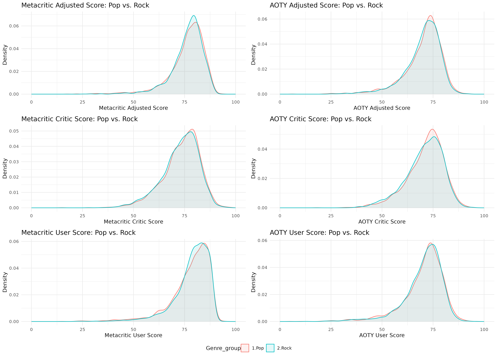
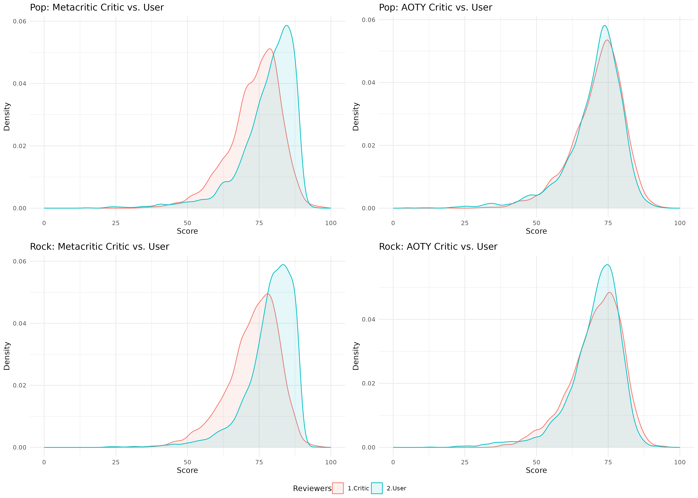
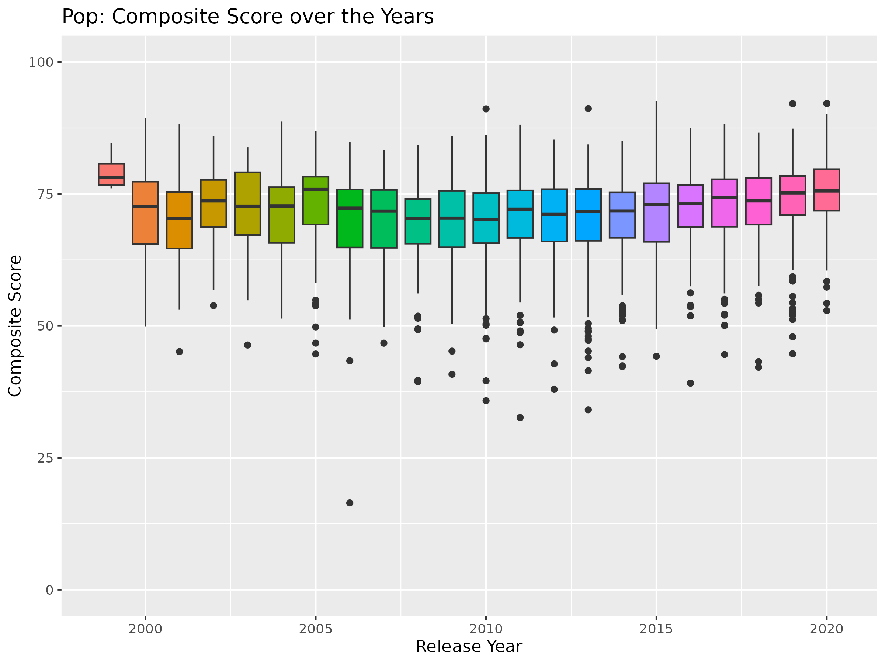
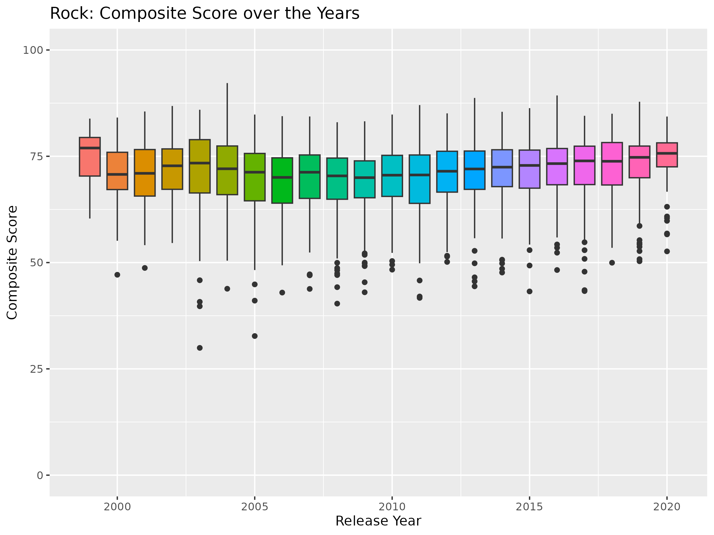
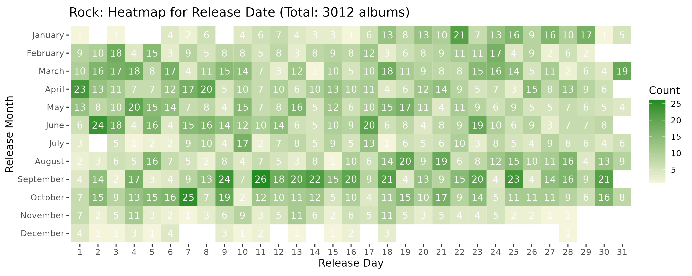

```{r setup, include=FALSE}
knitr::opts_chunk$set(echo = TRUE)
```

<br>

# Data Description

<br>

The datasets used in this analysis are downloaded from the following kaggle page:

https://www.kaggle.com/datasets/kauvinlucas/30000-albums-aggregated-review-ratings

Please follow the link to see more detailed description of the dataset. I will provide a brief overview. 

There are three original data files, including album_ratings.csv (I will refer to it as "album ratings data"), and a test.csv and train.csv in the album_reviews folder. The test.csv and train.csv files were split from one dataset for the purpose of model building, so I will refer to them together as "album reviews data". 

The album ratings data have 16 variables, including information on album title, artist name, release date, format, label company name, genre, and numerical ratings and numbers of reviews from both critics and users on Metacritic (www.metacritic.com) and AOTY (www.albumoftheyear.org), which are both reputable and popular platforms for music critics and music consumers to share their ratings and reviews on albums. The album ratings data has more than 30,000 albums recorded, however, some albums have missing information for certain variables. 

The album reviews data have 6 variables, including information on album title, artist name, media source of rating/review, numeric rating and textual review given by the media, and the reception classification of the album, which simply categorizes the numerical ratings into 5 strata: Acclaim (81-100), Favorable (61-80), Mixed (41-60), Unfavorable (21-40), and Dislike (0-20). Some of the most popular media sources from the album reviews are: Allmusic, Pitchfork, Popmatters, Uncut, Q magazine, etc. The album reviews data has recorded more than 166,000 album-media source parings, however, no media source have reviewed all the albums. 

<br>

# Data Preprocessing

<br>

For my analysis, I used both album ratings data and album reviews data. Here is a brief overview of what I did to prepare the data for analysis. 

In rate_data_prep.R, I preprocessed the album ratings data. I removed duplicate album entries. Then, I categorized the albums into "Pop", "Rock", and "Neither" based on their genre. Then, I created an adjusted score for each of Metacritic and AOTY, by combining the critic scores and user scores with weights based on the number of critic reviews and user reviews. 

In rev_data_prep.R, I first combined test and train sets of the album reviews data. I then removed the text field and reception variable, and any duplicate albums-media source parings, to prepare for pivoting the data. Then, I pivoted the data wider, so that each row of the transformed dataset represents one distinct album and has information on the album's ratings from each source (NA for a specific source variable, if the album did not recieve rating from that source). In the end, the dataset has 133 columns, even though columns represented by the not-so-popular media sources are mostly empty. 

In data_merge.R, I merged (inner-join) the two preprocessed datasets by album, specifically album title and artist name. Then I created a composite score variable that takes average of the adjusted Metacritic and AOTY scores and all the available ratings scores from media sources for each album. 

<br>

# Visualization and Analysis

<br>

### Pop vs. Rock

<br>

First, I make some overlaid density plots comparing distributions of adjusted, critic only, and user only scores between pop and rock albums. 

<br>

{width=100%}

<br>

In general, the distributions under all settings are similar in shape. This means pop and rock albums are similarly received in general. 

For AOTY, all adjusted, critic, and user scores peaked at around 75 for both pop and rock albums. 

For Metacritic, pop and rock albums have similar distributions, however, it appears that users tend to give higher scores to albums compared to critics. I explore this nuance by making more overlaid density plots, this time focusing on comparing the critic scores and user scores.

<br>

### Critic vs User

<br>

{width=100%}

<br>

The Metacritic plots confirms the difference between critic and user scores for both pop and rock albums in a similar fashion. Metacritic users tend to give higher scores to albums compared to Metacritic critics. It is interesting that AOTY data does not display the same pattern. This may have to do with the differing targeted audience between the two media sites. 

It is worth noting that for AOTY, users tend give more consistent scores compared to critics, as evident in the taller peak, skinner peak. This may be because the users are more easily influenced by other users' reviews and ratings, explained by the herd behavior.

<br>

### Scores Through the Years

<br>

Beside comparing pop and rock albums receptions, I am interested to see how the distribution of album ratings have evolved through time. So I made side-by-side boxplots for the distribution of composite score by release year of albums. 

<br>

<center>{width=50%}</center>

<center>{width=50%}</center>

<br>

Both pop and rock genre have experience a similar progression of reception throughout the past two decades. From 2000 to 2010, there is a slight decrease in reception for both pop and rock albums, the decrease is more prominent in rock albums. From 2010 to 2020, there is a steady increase in reception for both pop and rock albums. This may be due to the rise in popularity of electronic music around 2010, and a shift in attention away from electronic music after 2015 as hip hop dramatically increase in popularity. Note: Hip hop is categorized as pop and electronic music is categorized as neither pop or rock in our analysis. 

<br>

### Release Calendar Heatmap

<br>

I am also interested to find out if there is a pattern in the time of year where album release took place. So, I made heatmaps based on the number of album releases on each day of a calendar year. 

<br>

<center>{width=70%}</center>

<center>{width=70%}</center>

<br>

Once again, pop and rock albums have similar release calendar heatmaps. There are less album releases in the summer and holiday season. I suppose it is only natural musical artists and producers also take a break when we do. Upon visually inspecting, the most popular months to release albums are March, April, September, and October. 

<br>

# Conclusion

<br>

This was a rudimentary exploratory data analysis that provided insight to some interesting questions:

1. How do receptions differ between pop and rock albums?

2. How do critic and user ratings of albums differ?

3. How do album receptions change over the years? Does it differ between pop and rock albums?

4. Is there patterns to when albums are release in a calendar year?

Following the analysis above, I would consider performing PCA and cluster analysis to the ratings from all different media sources, however I will have to impute missing data prior to PCA. I am also considering building a predictive model predicting the genre based on ratings, but seeing how similar pop and rock albums performs in ratings, I doubt the model will perform well, maybe I will need to categorize the genres into more distinct groups. In addition, I did not take advantage of the text data for the actual reviews provided in the raw data, I would like to conduct topic modeling to see if there certain words in the review relates to the higher ratings. It could also be interesting to see how the popular words in reviews differ among genres. 

<br>

